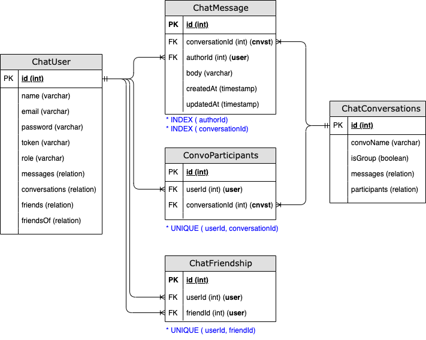

### Workflow
I'm using node to host both the express server, and the socket.io servers for chats. The express app handles middlewares and routes. 
Each route can then publish messages to the socket io connection. The react frontend connects to the server, and can subscribe to 
topics from my websocket.
```bash
Express App (middlewares, routes)
          ↓
Create HTTP Server (http.createServer(app))
          ↓
Initialize Socket.IO (setupSocket(server))
          ↓
Start Listening (server.listen(PORT))
```

### Schema
Setting up the schema was one of the most challenging parts for me. I initially tried a simple schema with only messages and users but 
found out it couldn't scale to individual vs. group conversations. After taking a couple of days off to plan and watch some system design 
videos, I defined the schema below.

<div style="width: min(711px, 98%); height: auto; margin: 0 auto;">
    
    <figcaption style="text-align:center"><p>Messaging app entity relation diagram (ERD)</p></figcaption>
</div>

The key differentiator was using a `Conversation` table to track whether a conversation was a group conversation or one-on-one conversation.
Prior to implementing the schema above, I had a ChatRoom table which worked well for group conversations but not for one-on-one. Having a 
*conversationId* allows you to assign specific rooms to each conversation, using your *conversationId* with websockets. This works for 
single or group messages alike, and events can be emitted/broadcast to all subscribing clients. Users can create a new group which just 
adds a new conversation entry in the db with a specified Name. One-on-one conversations do not need a name and the express controller 
includes the receivers name with prisma in the request response.

### Postman
In postman, click on the `New` button to add a `Socket.io` request. This cannot be used with a http collection. Once the socket is added, 
use the server url to connect to it e.g.`http:localhost:3000`. The connection is persisted, and you can add event topics to your connection 
under the events tab. There's a toggle button to listen to new events.

### Rooms / Groups
To listen to events from a room, you need to have joined the room. On the client, from the sidebar, for each link that they click on, a 
`useEffect` can be used to join the room. That way all new messages sent to the room will be visible to everyone connected to that room.
```JS
// Client 
socket.emit('joinConversation', conversationId);

// Server
socket.on('joinConversation', (conversationId) => {
    socket.join(`chat:${conversationId}`);
});
```
All groups are public in this simple iteration. Privatizing groups can be done with RBAC to allow only approved participants and 
assigning a group admin but it wasn't a project requirement.

### Todo
- [ ] handle logic for file uploads to supabase